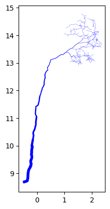
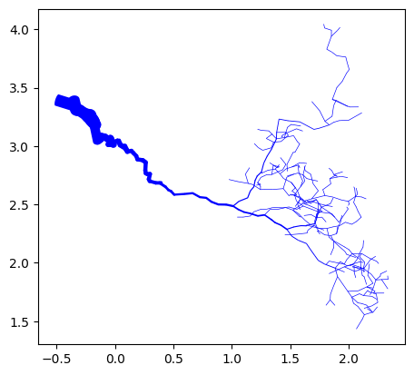
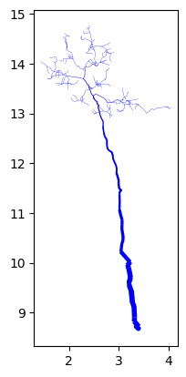
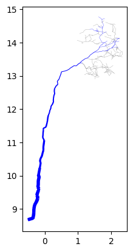
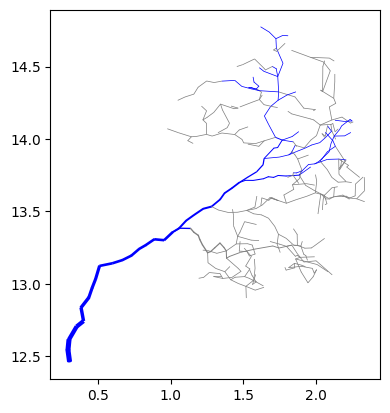
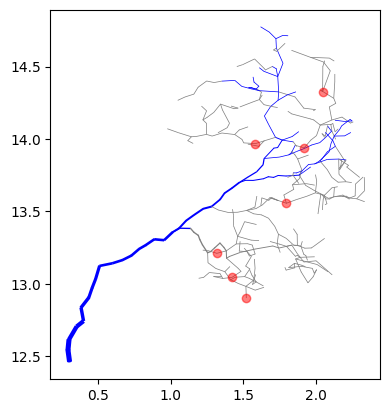
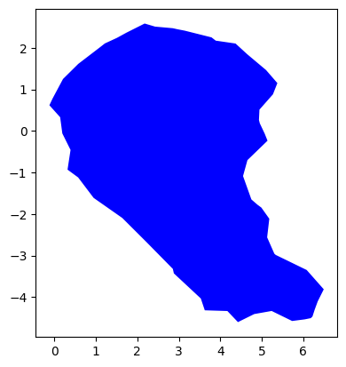
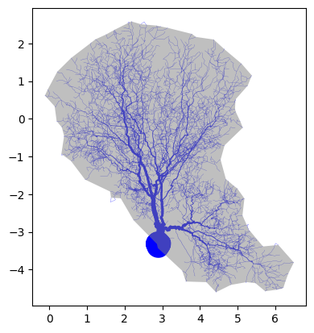
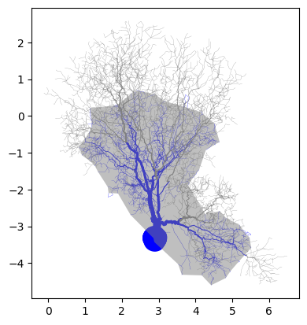

<head>
   <meta charset=utf-8 />
</head>
<h1 align="center">CanoPyHydro</h1>
<p align="center">
    
</p>
<p align="center"> </p>
<h3 align="center">Table of Contents</h3>
   <p align="center">
     <a href="#summary">Summary</a> •
     <a href="#functionality-overview">Functionality Overview</a> •
     <a href="#publications-and-acknowledgements">Publications and Acknowledgements</a>
   </p>
   <p align="center">
     <a href="#installing-canopyhydro">Installing CanoPyHydro</a> •
     <a href="#future-direction">Future Direction</a> •
     <a href="#contributing">Contributing</a>
   </p>

   CanoPyHydro was developed in the process of authoring [A LiDAR-driven pruning algorithm to delineate canopy drainage areas of stemflow and throughfall drip points]('https://doi.org/10.1111/2041-210X.14378'). Detailed information regarding package use cases, the definitions of relevant terms and the methods available in the package can be found in our [documentation](https://canopyhydrodynamics.readthedocs.io/en/latest/).

## Summary
CanoPyHydro takes a bottom-up approach towards predicting precipitation redistribution; enriching Lidar-derived QSM data with additional structure via graph based hydrological models and traversing said graph to determine its connectivity. This can be interpreted as a series of simulations in which we ask the question: "After water lands on the branch represented by a given cylinder, where does it go?". In this way, canoPyHydro allows for the percise delineation of:

- Stemflow and throughfall generating areas of the canopy
- The 'drip points' to which throughfall is directed - complete with their relative volumes
- 'Divides' and 'confluences' within the canopy that dictate the flow of water through the canopy

The current tool set also boasts several different spacial analysis tools, several of which have been utilized in the study of non-hydrological environmental conditions within tree canopies. These include:

- Functionality for characterizing the level of obsfucation present at given canopy cross sections
- Tools for identifying, highlighting and isolating branch subnetworks meeting any arbitrary contition(s)
  - i.e. only branches with a radius > 10cm, branches with a branch order of 0 within 100cm of the ground, ...
- 2D and 3D visualization functionality to interactively to explore the structure of tree canopies

# Functionality Overview

The below tutorial is a great starting place for those looking to get a feel for the capabilities of canoPyHydro. The tutorial will cover the creation of a CylinderCollection object, options for the visualization of QSMs in 2D and the calculation of flow characteristics.

The Cylinder class is used to represent the 3-D cylinders that make up a QSM. The most important function of these Cylinder objects is their ability to return data regarding the projections onto the XY, XZ and YZ planes.

```{python}
  myCyl = Cylinder(
    cyl_id=1.0,
    x=[3, 6],
    y=[2, 4],
    z=[6, 12],
    radius=2.0,
    length=0.064433,
    branch_order=0.0,
    branch_id=0.0,
    volume=0.010021,
    parent_id=0.0,
    reverse_branch_order=32.0,
    segment_id=0.0,
  )
  fig = myCyl.draw_3D(show=False, draw_projections=True)
```

<div align="center">
  <div class="container">
    
  </div>
</div>

The Cylinder Collection class is a data class consisting of multiple cylinders and related metrics. Cylinder Collections almost always represent [QSMs](https://canopyhydrodynamics.readthedocs.io/en/latest/qsms.html#) or parts of a QSM and are meant to help users explore these QSMs. Below, we demonstrate how one might create a cylinder collection using cylinder data (e.g. QSM data) stored in a CSV file and how the afforementioned concept of projections can be used to visualize the data in a variety of ways.
Note: the tree chosen for the below is intentionally small to make the visualization easier to understand.

```{python}
# Creating a CylinderCollection object
myCollection = CylinderCollection()

# The below file is one of our several testing files featuring only
# the trunk of a tree and one of its branches
myCollection.from_csv("charlie_brown.csv")

# plot the tree as seen from the 'front'
myCollection.draw("XZ")

# plot the tree as seen from above
myCollection.draw("XY")

# plot the tree as seen from the 'side'
myCollection.draw("YZ")
```

<div align="center">
  <div class="container">
    
    <p>XZ Projection</p>
  </div>
  <div class="container">
    
    <p>XY Projection</p>
  </div>
  <div class="container">
    
    <p>YZ Projection</p>
  </div>
</div>

Compared to a QSM, CylinderCollections have additional structure in the form of a digraph model. These digraph models represent the direction water flows along the branches of the modeled tree and are used in the 'find_flow_components' and 'calculate_flows' function to characterize the flow of water through the canopy. The below code, continuing from the above demonstrates the use of these functions.

```{python}
# creating the digraph model
myCollection.initialize_digraph_from()

# Identifying the flows to which each cyl belongs
myCollection.find_flow_components()

# Calculating the propreties of each flow
myCollection.calculate_flows()

# Print out recommend flow characteristics
print(myCollection.flows)
```
| num_cylinders | projected_area | surface_area | angle_sum | volume | sa_to_vol | drip_node_id | drip_node_loc |
|-----|-----|-----|-----|-----|-----|-----|-----|
| 162.0 | 0.345 | 1.167 | 111.92 | 0.019 | 82717.985 | 0.0 | (-0.5, 3.4, 8.7) |
| 18 | 0.005 | 0.021 | 10.275 | 0.0 | 14370.354 | 232 | (1.9, 2.2, 13.9) |
| 13 | 0.004 | 0.015 | 7.718 | 0.0 | 11229.764 | 360 | (1.8, 2.6, 13.6) |
| 24 | 0.008 | 0.032 | 1.697 | 0.0 | 18378.751 | 515 | (1.5, 2.8, 12.9) |
| ... | ... | ... | ... | ... | ... | ... | ... |

What you see above is a sample of the flow characteristics calculated for the 'charlie_brown' tree. The first flow listed is, as is the convention in canoPyHydro, the tree's stemflow and the others are the throughfall flows. The 'drip_node_loc' column lists the x,y,z coordinates of the node of the afformentioned graph to which water intercepted by the flow's cylinders is directed. The various geometric characteristics give a sense of the size and shape of the flow's cylinders (or 'canopy drainage area').

The draw function also allows for a variety of different overlays, filtering and highlighting. To demonstrate this briefly, we will show below how this filtering can be used in a variety of ways, including highlighting the various flows mentioned above. For more information on the CylinderCollection class, please refer to the [documentation](https://canopyhydrodynamics.readthedocs.io/en/latest/objects.html#canopyhydrodynamics.objects.CylinderCollection).


```{python}
# Plot the entire tree with stem flow highlighted
myCollection.draw("XZ", highlight_lambda=lambda:is_stem)

# Plot the interesting portion of the tree with stem flow highlighted
myCollection.draw("XZ",
                  highlight_lambda=lambda:is_stem,
                  filter_lambda=lambda: cyl_id>100)

# Adding drip points to the above mentioned plot
myCollection.draw("XZ",
                  highlight_lambda=lambda:is_stem,
                  filter_lambda=lambda: cyl_id>100,
                  include_drips=True)
```

<div align="center">
  <div class="container">
    
    <p> <em>The entire tree, with stemflow generating branches highlighted in blue.</em> </p>
  </div>
  <div class="container">
    
    <p> <em> A filtered subset of the same tree, note how sections of outward slope seperate blue, 
               stemflow generating cylinders from grey, non-stemflow/throughfall generating cylinders </em></p>
  </div>
    
    <p> <em>The same filtered subsetm now with drip nodes indicted in red. Note how each seperates a given set of thoughfall generating cylinders from the stemflow cylinders </em> </p>
</div>

The final bit of functionality we will review here is the ability to create concave hulls around groups of cylinders in a CylinderCollection. This is done using the 'watershed_boundary' function. The below code demonstrates how this function can be used to find a concave hull around the entire tree, or a portion of the tree. Note that a new, more robist example tree is used

```{python}
# Reading in the tree data and finding flows
myCollection = CylinderCollection()
myCollection.from_csv("example_tree.csv")
myCollection.project_cylinders("XY")
myCollection.initialize_digraph_from()
myCollection.find_flow_components()
myCollection.calculate_flows()

#drawing the tree for reference
myCollection.draw("XY", save=True, file_name_ext="read_me_alpha")

# Drawing the whole canopy boundary
myCollection.watershed_boundary(plane = 'XY', draw=True)

# Drawing the canopy boundary and tree together
myCollection.draw("XY",
                  include_alpha_shape=True)

# Drawing a tighter fitting alpha shape
myCollection.watershed_boundary(plane = 'XY',
                                curvature_alpha=2,
                                draw=True)
myCollection.draw("XY",
                  include_alpha_shape=True)

# Drawing the stem flow watershed boundary
# with stemflow cylinders highlighted
myCollection.watershed_boundary(plane = 'XY',
                                curvature_alpha=2,
                                filter_lambda=lambda: is_stem)
myCollection.draw("XY",
                  include_alpha_shape=True,
                  highlight_lambda=lambda: is_stem)
```
<div align="center">
  <div class="container">
    
    <p>Entire canopy hull alone</p>
  </div>
  <div class="container">
    
    <p>Hull overlaid on the canopy</p>
  </div>
</div>
<div align="center">
  <div class="container">
    
    <p>A tighter fitting hull</p>
  </div>
  <div class="container">
    
    <p>The stem flow boundary hull</p>
  </div>
</div>


# Installing CanoPyHydro
   In order to run canoPyHydro locally, you will need to have installed [python]() on your local machine. Once python is installed, you can proceed to the setup steps described below. The entire set-up process (including installing python) should take <1hr. If you are encountering errors, or other complications when configuring your local environment, feel free to request some help by creating an ['issue'](https://github.com/wischmcj/canopyHydrodynamics/issues/new).

1. **Create a Virtual Environment**: Below we use the native 'venv' module to create a virtual environment. This is not strictly necessary, but it is a good practice to keep your project dependencies separate from your system dependencies in a virtual environment.
   ```bash
   python -m venv canHydroVenv
   ```
2. **Activate Your Environment**: Activate your virtual environment to install dependencies and run the project. The commands to activate the virtual environment depend on your operating system and shell. Below are the commands for activating the virtual environment in different operating systems and shells.

```bash
  # if using bash (Mac, Unix)
  source canHydroVenv/bin/activate
  # if using PowerShell (Windows)
  source canHydroVenv\Scripts\activate.ps1
```

3. **Install canoPyHydro**: canoPHydro is published with PyPA (the python packacing authority). You can install the latest stable release of canoPyHydro using pip. This installs our latest stable release as well as several libraries required for the use of the package's features. canoPyHydro currently supports Python versions 3.9 and up.

```bash
   pip install canoPyHydro
```

4. **Set Configuration Options**: The default configuration file can be found at '/CanopyHydrodynamics/canopyhydro_config.toml'. Configuration options can be set by altering the contents of that file in place. Refer to the [configuration page in the docs](https://canopyhydrodynamics.readthedocs.io/en/latest/getting_started.html#configuration) for more information on configuration options.

That's it! You're ready to start using canoPyHydro. Check out the the below tutorials and the [documentation](https://canopyhydrodynamics.readthedocs.io/en/latest/index.html) for more information on how to use the package.


# Publications and Acknowledgements:
   CanoPyHydro was developed in the process of authoring [A LiDAR-driven pruning algorithm to delineate canopy drainage areas of stemflow and throughfall drip points.]('https://doi.org/10.1111/2041-210X.14378'), which has been accepted for publication by the *'British Ecological Society's'* ['*Methods in Ecology and Evolution*'](https://www.britishecologicalsociety.org/publications/journals/methods-in-ecology-and-evolution/). Said paper, and the code within this repository, represents a collaboration between non-academic data professional Collin Wischmeyer, environmental science researcher [Professor John Van Stan](https://expertise.csuohio.edu/csufacultyprofile/detail.cfm?FacultyID=j_vanstan) with notable contributions from industry geo-scientist [Travis Swanson](https://thewaterinstitute.org/our-team/travis-swanson). Likewise, this tool could not exist without the data collected and the ideas put forward by several graduate students working in Cleveland State University's ['Wet Plant Lab'](https://www.researchgate.net/lab/Wet-Plant-Lab-John-Toland-Van-Stan).


# Future Direction
- We hope to widen the use cases for our tool by integrating additional real world data (i.e wind speed and direction, rain intensity and average angle, etc.).
- By integrating python libraries for spacial analysis (scipy-spacial, open3d) into canoPyHydro, we hope to allow for the projection of cylinders at an arbitrary angle. This will lead directly into supporting the afformentioned integration of weather data.
- Improve the efficiency of the flow finding algorithm and the flow caluclation algorithm. This will allow for the processing of larger QSMs and the use of more complex models (i.e. tessellated meshes).
  - Under the branch [improve-find-flows-efficiency](https://github.com/wischmcj/canopyHydrodynamics/tree/improve-find-flows-efficiency), you can see the current work being done to meet this goal. Early results so as much as a 200x increase in the speed of the algorithm as a result of:
    - migrating the the use of rust based graph models, using the rustworkx library
    - refactoring the current find flow algorithm as a graph traversal algorithm to enable parallel processing


# Contributing

As stated above, we do hope to improve and extend canoPyHydro's current functionally. As we build a roadmap and decide on which features to focus on in this process, we will put a heavy emphasis on needs of the ecophysiology/ecohydrology research community. That said, we welcome both feature proposals and code contributions to this project! You can feel free to contact the authors via email, or to follow the steps below individually.

## Bug Fixes and Feature Suggestions
If you encounter errors while running this package, or if you have suggestions for new functionality, you can quickly and easily inform the team by creating an ['issue'](https://github.com/wischmcj/canopyHydrodynamics/issues/new) for this repository.

## Editing and/or Contributing Code
   In order to successfully edit and test this package's code locally, you will need to 'clone' this repository to your local file system. Additionally, in order to properly test and build your code, you will need a few additional python libraries

1. **Create a Local Copy**: If you will be using git (recommended) to track and share your edits, you can run the below code to clone this repo and create a new branch to hold the changes you make:
   ```bash
   git clone https://github.com/wischmcj/canopyHydrodynamics.git
   cd canoPyHydrodynamics
   git checkout -b a-descriptive-name-for-the-changes-you-are-making
   ```
   Alternatively, if you happen to be unfamiliar with the git ecosystem, you can download the repository as a zip file. In this case, we still welcome you to share your work with the authors/other users by attaching the code you create in a git ['issue'](https://github.com/wischmcj/canopyHydrodynamics/issues/new).

3. **Install Additional Dependencies**: Some features (linting, git actions, etc.) may require additional dependencies. An additional 'requirements-dev.txt' file has been provided to install these dependencies.

   ```bash
   pip install -r requirements-dev.txt
   ```
4. **Install Pre-commit**: This repository utilizes the ruff pre-commit hook to ensure that all code is linted before being committed. To install pre-commit, run the following commands:

   ```bash
   pip3 install pre-commit
   pre-commit install
   ```
5. **Review the contributing Guidelines **: Check out the documentation, where you can find [contributing guidelines](https://canopyhydrodynamics.readthedocs.io/en/latest/contributing.html). Please note that this project is released with a Code of Conduct. By contributing to this project, you agree to abide by its terms.

Thank you for your interest in contributing to our project!
