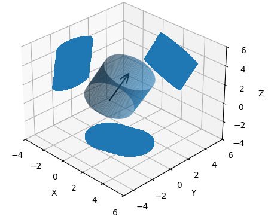
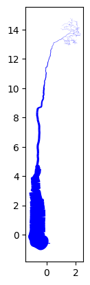
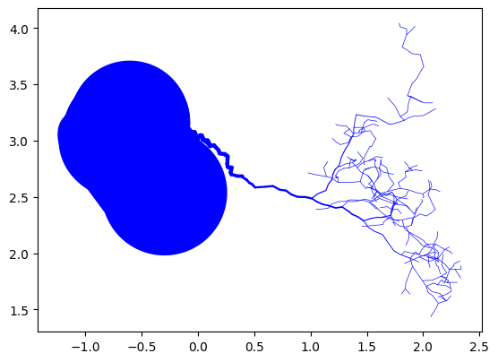
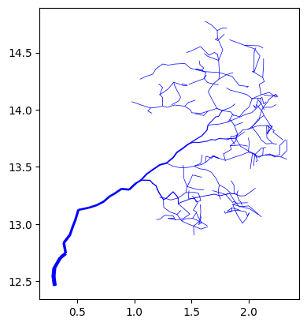
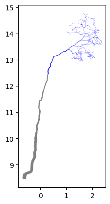

<head>
   <meta charset=utf-8 />
   <title></title>
   <style>
     div.container {
       display:inline-block;
     }

     p {
       text-align:center;
     }
   </style>
</head>
<p align="center">
    
</p>
<h1 align="center">CanoPyHydro</h1>
  <p align="center">
    Leveraging remote sensing to map water availability in tree canopies.
    </p>
</p>
<p align="center">
  <a href="#summary">Summary</a> •
  <a href="#getting-started">Getting Started</a> •
  <a href="#contributing">Contributing</a> •
  <a href="#publications">Publications</a> •
  <a href="#future-direction">Future Direction</a> •
  <a href="#tutorials">Tutorials</a>
</p>

# Summary

The goal of this and future versions of CanoPyHydro is to provide a tool set that empowers researchers and practitioners to gain new perspectives on rainfall distribution in forested environments. A list of publications that have utilized this tool-and influenced its development- can be found at the bottom of this page.

CanoPyHydro provides users access to an innovative, bottom-up approach to estimation precipitation redistribution. By enriching QSM data with additional structure via graph based hydrological models, canoPyHydro allows for the percise delineation of:'

- Stemflow and throughfall generating areas of the canopy
- The 'drip points' to which throughfall is directed - complete with their relative volumes
- 'Divides' and 'confluences' within the canopy that dictate the flow of water through the canopy

The current tool set also boasts several different spacial analysis tools, several of which have been utilized in the study of non-hydrological environmental conditions within tree canopies. These include:

- Functionality for characterizing the level of obsfucation present at given canopy cross sections
- Tools for identifying, highlighting and isolating branch subnetworks meeting any arbitrary contition(s)
  - i.e. only branches with a radius > 10cm, branches with a branch order of 0 within 100cm of the ground, ...
- 2D and 3D visualization functionality to interactively to explore the structure of tree canopies

## Getting Started

1. **Create a Virtual Environment**: Below we use the native 'venv' module to create a virtual environment. This is not strictly necessary, but it is a good practice to keep your project dependencies separate from your system dependencies in a virtual environment.
   ```bash
   python -m venv canHydroVenv
   ```
2. **Activate Your Environment**: Activate your virtual environment to install dependencies and run the project. The commands to activate the virtual environment depend on your operating system and shell. Below are the commands for activating the virtual environment in different operating systems and shells.

```bash
  # if using bash (Mac, Unix)
  source canHydroVenv/bin/activate
  # if using PowerShell (Windows)
  source canHydroVenv\Scripts\activate.ps1
```

3. **Install canoPyHydro**: canoPHydro is published with PyPA (the python packacing authority). You can install the latest stable release of canoPyHydro using pip. This installs our latest stable release as well as several libraries required for the use of the package's features. canoPyHydro currently supports Python versions 3.9 and up.

```bash
   pip install canoPyHydro
```

4. **Set Configuration Options**: The default configuration file can be found at '/CanopyHydrodynamics/canopyhydro_config.toml'. Configuration options can be set by altering the contents of that file in place. Refer to the [configuration page in the docs](https://canopyhydrodynamics.readthedocs.io/en/latest/getting_started.html#configuration) for more information on configuration options.

That's it! You're ready to start using canoPyHydro. Check out the the below tutorials and the [documentation](https://canopyhydrodynamics.readthedocs.io/en/latest/index.html) for more information on how to use the package.

# Tutorial
The Cylinder class is used to represent the 3-D cylinders that make up a QSM. The most important function of these Cylinder objects is their ability to return data regarding the projections onto the XY, XZ and YZ planes. 

```{python}
  myCyl = Cylinder(
    cyl_id=1.0,
    x=[3, 6],
    y=[2, 4],
    z=[6, 12],
    radius=2.0,
    length=0.064433,
    branch_order=0.0,
    branch_id=0.0,
    volume=0.010021,
    parent_id=0.0,
    reverse_branch_order=32.0,
    segment_id=0.0,
  )
  fig = myCyl.draw_3D(show=False, draw_projections=True)
```

<div class="container">
  
</div>

The Cylinder Collection class is more or less a list of 1 or more Cylinder objects. Cylinder Collections almost always represent [QSMs](https://canopyhydrodynamics.readthedocs.io/en/latest/qsms.html#) (or parts of a QSM), and are meant to help users explore their QSMs. Below, we demonstrate how one might can a cylinder collection using cylinder data (e.g. QSM data) stored in a CSV file and how that data can be drawn in a variety of ways.

```{python}
# Creating a CylinderCollection object
myCollection = CylinderCollection()

# The below file is one of our several testing files featuring only 
# the trunk of a tree and one of its branches
myCollection.from_csv("5_SmallTree.csv")

# The below code will plot the entire tree
myCollection.draw("XZ", 0)  # noqa

# The below code will plot the entire tree as seen from above
myCollection.draw("XY", 0)  # noqa

# The below code will plot only part of the tree
myCollection.draw("XZ", filter_lambda=lambda: cyl_id > 100)  # noqa

# Here we plot a bit more of the tree and 
#  highlight a portion as well
myCollection.draw("XZ", filter_lambda=lambda: cyl_id > 50,highlight_lambda=lambda: cyl_id > 100)  # noqa

```
<div align="center">
  <div class="container">
    
  </div>
  <div class="container">
    
  </div>
  <div class="container">
    
  </div>
  <div class="container">
    
  </div>
</div>  

As you can see above, the CylinderCollection class is a powerful tool for exploring QSM data; allowing users to filter and highlight data in a variety of ways.


# Contributing

We welcome contributions to this project! Whether it's reporting a bug, proposing a new feature, or contributing code, we appreciate your help. Here's how you can contribute:

1. **Install Additional Dependencies**: Some features (linting, git actions, etc.) may require additional dependencies. An additional 'requirements-dev.txt' file has been provided to install these dependencies.

   ```bash
   pip install -r requirements-dev.txt
   ```
2. **Install Pre-commit**: This repository utilizes the ruff pre-commit hook to ensure that all code is linted before being committed. To install pre-commit, run the following commands:

   ```bash
   pip3 install pre-commit
   pre-commit install
   ```
3. **Review the contributing Guidelines **: Check out the documentation, where you can find [contributing guidelines](https://canopyhydrodynamics.readthedocs.io/en/latest/contributing.html). Please note that this project is released with a Code of Conduct. By contributing to this project, you agree to abide by its terms.

Thank you for your interest in contributing to our project!

## Publications:

This repository houses python utilities described in 'A LiDAR-driven pruning algorithm to delineate canopy drainage areas of stemflow and throughfall drip points.'
A LiDAR-driven pruning algorithm to delineate canopy drainage areas of stemflow and throughfall drip points.
(https://www.researchgate.net/publication/375530854)

## Future Direction

- We hope to widen the use cases for our tool by integrating additionall real world data (i.e wind speed and direction, rain intensity and angle, etc.).
- By growing python libraries for spacial analysis (scipy-spacial, open3d) we hope to all for the projection of cylinders at an arbitrary angle, to support the afformentioned integration of weather data.
- Under the branch [improve-find-flows-efficiency](https://github.com/wischmcj/canopyHydrodynamics/tree/improve-find-flows-efficiency) you can see the current work being done to improve the efficiency of the flow finding algorithm. Early results so as much as a 200x increase in the speed of the algorithm as a result of:
  - migrating the the use of rust based graph models, using the rustworkx library
  - refactoring the current find flow algorithm as a graph traversal algorithm to enable parallel processing


# Tutorials

  The below code can be run at the first breakpoint in the test_collection_integration.py file

## Displaying, Filtering and Highlighting

    flexible_collection.draw(plane = 'XZ')
    flexible_collection.draw(plane = 'XZ', a_lambda = lambda: cyl_id>100)
    flexible_collection.draw(plane = 'XZ', filter_lambda = lambda: cyl_id>100)
    flexible_collection.draw(plane = 'XZ', filter_lambda = lambda: cyl_id>50)
    flexible_collection.draw(plane = 'XZ', filter_lambda = lambda: cyl_id>75)
    flexible_collection.draw(plane = 'XZ', filter_lambda = lambda: cyl_id>75, highlight_lambda = lambda:branch_order==2)
    flexible_collection.draw(plane = 'XZ', filter_lambda = lambda: cyl_id>100, highlight_lambda = lambda:branch_order==2)
    flexible_collection.draw(plane = 'XZ', filter_lambda = lambda: cyl_id>100, highlight_lambda = lambda:is_stem)

## Draw all projections

    import geopandas as geo  # only import what we need
    import matplotlib.pyplot as plt
    happy_path_projection.project_cylinders('XY')
    happy_path_projection.project_cylinders('XZ')
    happy_path_projection.project_cylinders('YZ')
    xz_poly = [cyl.projected_data['XZ']['polygon'] for cyl in happy_path_projection.cylinders[1:20]]
    xy_poly = [cyl.projected_data['XY']['polygon'] for cyl in happy_path_projection.cylinders[1:20]]
    yz_poly = [cyl.projected_data['YZ']['polygon'] for cyl in happy_path_projection.cylinders[1:20]]
    geoPolys_xy = geo.GeoSeries(xy_poly)
    geoPolys_xz = geo.GeoSeries(xz_poly)
    geoPolys_yz = geo.GeoSeries(yz_poly)
    fig, ax = plt.subplots(3)
    geoPolys_xy.plot(ax=ax[0,0])
    geoPolys_xy.plot(ax=ax[0])
    geoPolys_xz.plot(ax=ax[1])
    geoPolys_yz.plot(ax=ax[2])
