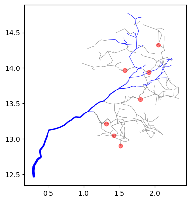
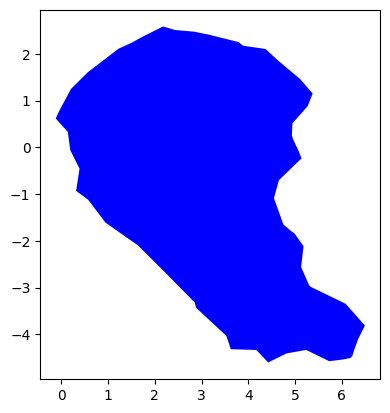
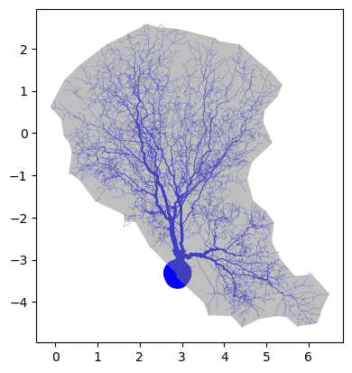

<head>
   <meta charset=utf-8 />
   <title></title>
   <style>
    div.container {
      display:inline-block;
    }

    p {
      text-align:center;
    }

    img {
      display: block;
      margin-left: auto;
      margin-right: auto;
    }

    figcaption {
      font-size: 15px;
      text-align:center;
    }
   </style>
</head>
<p align="center">
    
</p>
<h1 align="center">CanoPyHydro</h1>
  <p align="center">
    Leveraging remote sensing to map water availability in tree canopies.
    </p>
</p>
<p align="center">
  <a href="#summary">Summary</a> •
  <a href="#getting-started">Getting Started</a> •
  <a href="#contributing">Contributing</a> •
  <a href="#publications">Publications</a> •
  <a href="#future-direction">Future Direction</a> •
  <a href="#tutorials">Tutorials</a>
</p>

## Summary

The goal of this and future versions of CanoPyHydro is to provide a tool set that empowers researchers and practitioners to gain new perspectives on rainfall distribution in forested environments. A list of publications that have utilized this tool-and influenced its development- can be found at the bottom of this page.

CanoPyHydro provides users access to an innovative, bottom-up approach to estimation precipitation redistribution. By enriching QSM data with additional structure via graph based hydrological models, canoPyHydro allows for the percise delineation of:'

<ul>
  <li>Stemflow and throughfall generating areas of the canopy</li>
  <li>The 'drip points' to which throughfall is directed - complete with their relative volumes</li>
  <li>'Divides' and 'confluences' within the canopy that dictate the flow of water through the canopy</li>
</ul>

The current tool set also boasts several different spacial analysis tools, several of which have been utilized in the study of non-hydrological environmental conditions within tree canopies. These include:

<ull>
  <li>Functionality for characterizing the level of obsfucation present at given canopy cross sections</li>
  <li>Tools for identifying, highlighting and isolating branch subnetworks meeting any arbitrary contition(s)</li>
  <li>i.e. only branches with a radius > 10cm, branches with a branch order of 0 within 100cm of the ground, ...</li>
  <li>2D and 3D visualization functionality to interactively to explore the structure of tree canopies</li>
</ul>
# Tutorial
The Cylinder class is used to represent the 3-D cylinders that make up a QSM. The most important function of these Cylinder objects is their ability to return data regarding the projections onto the XY, XZ and YZ planes.

```{python}
  myCyl = Cylinder(
    cyl_id=1.0,
    x=[3, 6],
    y=[2, 4],
    z=[6, 12],
    radius=2.0,
    length=0.064433,
    branch_order=0.0,
    branch_id=0.0,
    volume=0.010021,
    parent_id=0.0,
    reverse_branch_order=32.0,
    segment_id=0.0,
  )
  fig = myCyl.draw_3D(show=False, draw_projections=True)
```

<div align="center">
  <div class="container">
    
  </div>
</div>
The Cylinder Collection class is a data class consisting of multiple cylinders and related metrics. Cylinder Collections almost always represent [QSMs](https://canopyhydrodynamics.readthedocs.io/en/latest/qsms.html#) or parts of a QSM and are meant to help users explore these QSMs. Below, we demonstrate how one might create a cylinder collection using cylinder data (e.g. QSM data) stored in a CSV file and how the afforementioned concept of projections can be used to visualize the data in a variety of ways.
Note: the tree chosen for the below is intentionally small to make the visualization easier to understand.

```{python}
# Creating a CylinderCollection object
myCollection = CylinderCollection()

# The below file is one of our several testing files featuring only
# the trunk of a tree and one of its branches
myCollection.from_csv("charlie_brown.csv")

# plot the tree as seen from the 'front'
myCollection.draw("XZ")

# plot the tree as seen from above
myCollection.draw("XY")

# plot the tree as seen from the 'side'
myCollection.draw("YZ")
```

<div align="center">
  <div class="container">
    
    <p>XZ Projection</p>
  </div>
  <div class="container">
    
    <p>XY Projection</p>
  </div>
  <div class="container">
    
    <p>YZ Projection</p>
  </div>
</div>

Compared to a QSM, CylinderCollections have additional structure in the form of a digraph model. These digraph models represent the direction water flows along the branches of the modeled tree and are used in the 'find_flow_components' and 'calculate_flows' function to characterize the flow of water through the canopy. The below code, continuing from the above demonstrates the use of these functions.

```{python}
# creating the digraph model
myCollection.initialize_digraph_from()

# Identifying the flows to which each cyl belongs
myCollection.find_flow_components()

# Calculating the propreties of each flow
myCollection.calculate_flows()

# Print out calcualted flow characteristics
print(myCollection.flows)
```
| num_cylinders | projected_area | surface_area | angle_sum | volume | sa_to_vol | drip_node_id | drip_node_loc |
|-----|-----|-----|-----|-----|-----|-----|-----|
| 162.0 | 0.345 | 1.167 | 111.92 | 0.019 | 82717.985 | 0.0 | (-0.5, 3.4, 8.7) |
| 18 | 0.005 | 0.021 | 10.275 | 0.0 | 14370.354 | 232 | (1.9, 2.2, 13.9) |
| 13 | 0.004 | 0.015 | 7.718 | 0.0 | 11229.764 | 360 | (1.8, 2.6, 13.6) |
| 24 | 0.008 | 0.032 | 1.697 | 0.0 | 18378.751 | 515 | (1.5, 2.8, 12.9) |
| ... | ... | ... | ... | ... | ... | ... | ... |

What you see above is a sample of the flow characterstics calculated for the 'charlie_brown' tree. The first flow listed is, as is the convention in canoPyHydro, the tree's stemflow and the others are the throughfall flows. The 'drip_node_loc' column lists the x,y,z coordinates of the node of the afformentioned graph to which water intercepted by the flow's cylinders is directed. The various geometric characteristics give a sense of the size and shape of the flow's cylinders (or 'canopy drainage area').

The draw function also allows for a variety of different overlays, filtering and highlighting. To demonstrate this briefly, we will show below how this filtering can be used in a variety of ways, including highlighting the various flows mentioned above. For more information on the CylinderCollection class, please refer to the [documentation](https://canopyhydrodynamics.readthedocs.io/en/latest/objects.html#canopyhydrodynamics.objects.CylinderCollection).


```{python}
# Plot the entire tree with stem flow highlighted
myCollection.draw("XZ", highlight_lambda=lambda:is_stem)

# Plot the interesting portion of the tree with stem flow highlighted
myCollection.draw("XZ",
                  highlight_lambda=lambda:is_stem,
                  filter_lambda=lambda: cyl_id>100)

# Adding drip points to the above mentioned plot
myCollection.draw("XZ",
                  highlight_lambda=lambda:is_stem,
                  filter_lambda=lambda: cyl_id>100,
                  include_drips=True)
```

<div align="center">
  <div class="container">
    
    <figcaption>Plot of the entire tree </figcaption>
  </div>
  <div class="container">
    
    <figcaption>Same as left but zoomed in</figcaption>
  </div>
  <div class="container">
    
    <figcaption>Adding locations of drip points</figcaption>
  </div>
</div>

The final bit of functionality we will review today is the ability to create concave hulls around groups of cylinders in a CylinderCollection. This is done using the 'watershed_boundary' function. The below code demonstrates how this function can be used to find a concave hull around the entire tree, or a portion of the tree. Note that a new, more robist example tree is used

```{python}
# Reading in the tree data and finding flows
myCollection = CylinderCollection()
myCollection.from_csv("example_tree.csv")
myCollection.project_cylinders("XY")
myCollection.initialize_digraph_from()
myCollection.find_flow_components()
myCollection.calculate_flows()

#drawing the tree for reference
myCollection.draw("XY", save=True, file_name_ext="read_me_alpha")

# Drawing the whole canopy boundary
myCollection.watershed_boundary(plane = 'XY', draw=True)

# Drawing the canopy boundary and tree together
myCollection.draw("XY",
                  include_alpha_shape=True)

# Drawing a tighter fitting alpha shape
myCollection.watershed_boundary(plane = 'XY',
                                curvature_alpha=2,
                                draw=True)
myCollection.draw("XY",
                  include_alpha_shape=True)

# Drawing the stem flow watershed boundary
# with stemflow cylinders highlighted
myCollection.watershed_boundary(plane = 'XY',
                                curvature_alpha=2,
                                filter_lambda=lambda: is_stem)
myCollection.draw("XY",
                  include_alpha_shape=True,
                  highlight_lambda=lambda: is_stem)
```
<div align="center">
  <div class="container">
    
    <figcaption>Entire canopy hull alone</figcaption>
  </div>
  <div class="container">
    
    <figcaption>Hull overlaid on the canopy</figcaption>
  </div>
</div>
<div align="center">
  <div class="container">
    
    <figcaption>A tighter fitting hull</figcaption>
  </div>
  <div class="container">
    
    <figcaption>The stem flow boundary hull</figcaption>
  </div>
</div>

## Publications:

This repository houses python utilities described in 'A LiDAR-driven pruning algorithm to delineate canopy drainage areas of stemflow and throughfall drip points.'
A LiDAR-driven pruning algorithm to delineate canopy drainage areas of stemflow and throughfall drip points.
(https://www.researchgate.net/publication/375530854)

## Future Direction

- We hope to widen the use cases for our tool by integrating additionall real world data (i.e wind speed and direction, rain intensity and angle, etc.).
- By growing python libraries for spacial analysis (scipy-spacial, open3d) we hope to all for the projection of cylinders at an arbitrary angle, to support the afformentioned integration of weather data.
- Under the branch [improve-find-flows-efficiency](https://github.com/wischmcj/canopyHydrodynamics/tree/improve-find-flows-efficiency) you can see the current work being done to improve the efficiency of the flow finding algorithm. Early results so as much as a 200x increase in the speed of the algorithm as a result of:
  - migrating the the use of rust based graph models, using the rustworkx library
  - refactoring the current find flow algorithm as a graph traversal algorithm to enable parallel processing


# Contributing

We welcome contributions to this project! Whether it's reporting a bug, proposing a new feature, or contributing code, we appreciate your help. Here's how you can set up you local environment in order to do so:

1. **Install Additional Dependencies**: Some features (linting, git actions, etc.) may require additional dependencies. An additional 'requirements-dev.txt' file has been provided to install these dependencies.

   ```bash
   pip install -r requirements-dev.txt
   ```
2. **Install Pre-commit**: This repository utilizes the ruff pre-commit hook to ensure that all code is linted before being committed. To install pre-commit, run the following commands:

   ```bash
   pip3 install pre-commit
   pre-commit install
   ```
3. **Review the contributing Guidelines **: Check out the documentation, where you can find [contributing guidelines](https://canopyhydrodynamics.readthedocs.io/en/latest/contributing.html). Please note that this project is released with a Code of Conduct. By contributing to this project, you agree to abide by its terms.

Thank you for your interest in contributing to our project!
