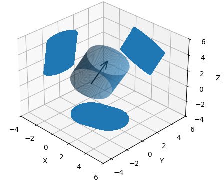
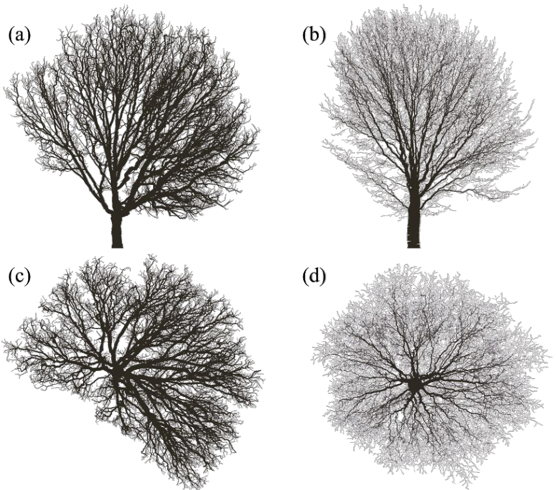
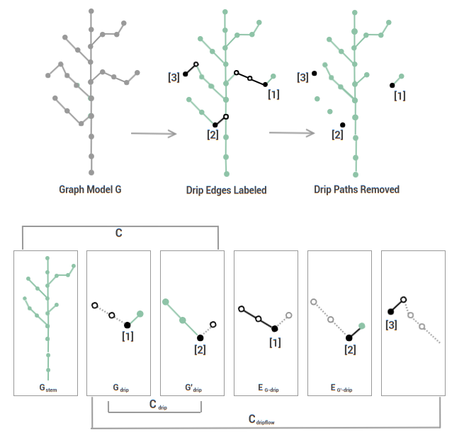
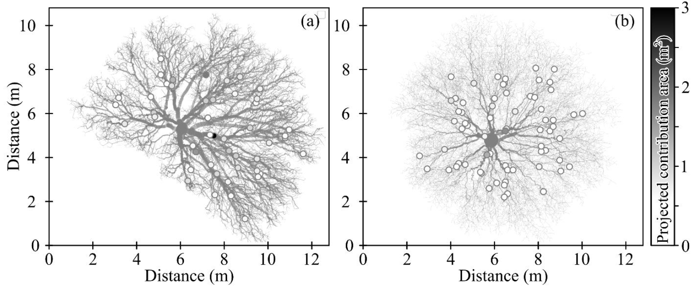

<head>
   <meta charset=utf-8 />
   <style>
      div.container {
        display:inline-block;
      }
      p {
        text-align:center;
      }
      img {
        display: block;
        margin-left: auto;
        margin-right: auto;
      }
      figcaption {
        font-size: 15px;
        text-align:center;
      }
   </style>
</head>
<div align="center">
  
  <h1>CanoPyHydro</h1>
  <p>Leveraging LiDAR to map water availability in tree canopies.</p>
</div>
<p align="center">
  <a href="#summary">Summary</a> •
  <a href="#statement-of-need">Statement of Need</a> •
  <a href="#functionality">Functionality</a> •
  <a href="#future-direction">Future Direction</a> •
  <a href="#acknowledgements">Acknowledgements</a> •
  <a href="#references">References</a> •
  <a href="examples.md">More Examples</a>
</p>
<p align="center">
  Vegetation coverage has a marked effect on the spatiotemporal distribution of terrestrial rainfall, marking the initial step in terrestrial rainfall-to-runoff pathways. <!-- As we demonstrate below, the importance of this 'precipitation partitioning' is well established in the field of hydrology and is of increasing interest in the modeling of ecological and biogeochemical processes.  -->
  Growing interest from hydrologists and environmental scientists has led to numerous attempts to characterize these flows. However, these efforts have largely been correlative and regression-based, lacking clear frameworks to guide meaningful inferences (Van Stan et al., 2020).
  CanoPyHydro empowers researchers to derive mechanistic inferences into the drivers underlying variability in canopy rainfall drainage fluxes and has garnered interest for its versatility across related use-cases. By integrating precipitation partitioning data with increasingly available terrestrial lidar scans (TLS), canoPyHydro offers a tailored environment to explore canopy water distribution, enhancing the precision and depth of hydrological analyses.
</p>

# Summary

The main inputs to canoPyHydro are Quantitative Structural Models (QSMs), which distill TLS point clouds of trees into topologically ordered cylinders representing branch structures. CanoPyHydro's functionality is divided into two groups: utilities for QSM ingestion and exploration, and utilities for predicting percipitation partitioning.

CanoPyHydro introduces a novel approach by treating tree canopies as watersheds to reveal the tributary-like flows within branch networks. It precisely distinguishes which flows reach the trunk (thus becoming stemflow) and delineates areas where water drips to the forest floor (as throughfall). 

For tree-data explorers, CanoPyHydro's spatial utilities stand out. The use of [Alpha Shapes](https://en.wikipedia.org/wiki/Alpha_shape) enables novel interpretations of canopy coverage area, while detailed _intra_-canopy cross-sections offer precise insights into the vertical shading within the canopy and protection from wind/rain (in the horizontal direction).

# Statement of Need

Net rainfall (throughfall + stemflow) reaching the surface beneath plant canopies influences all subsequent terrestrial hydrological processes, contributing to runoff (Savenije, 2004), recharging subsurface water (Friesen, 2020), or returning to the atmosphere via evaporation (Coenders-Gerrits et al., 2020). However, there is substantial spatiotemporal variability in net rainfall amount, timing, and distribution, complicating reliable assessments of terrestrial water balances (Van Stan et al., 2020). The costly, labor-intensive techniques required to observe throughfall and stemflow (e.g., Voss et al., 2016; Zimmermann and Zimmermann, 2014) challenge current approaches to modelling and managing terrestrial water interactions (Gutmann, 2020).

Attempts to correlate whole canopy characteristics with stemflow measurements have produced inconclusive results (Sadeghi et al., 2020), despite advances in tree scanning and structural modelling tools (see references in Wischmeyer et al., 2024). A definitive method for accurately delineating these flux origins, crucial for understanding rainfall distribution, remains elusive.

CanoPyHydro addresses this gap with an innovative, bottom-up approach to estimating precipitation redistribution, supplementing QSMs generated using existing tools (Hackenberg et al., 2021) with complemntary, graph-based models. CanoPyHydro's algorithm traverses these graph models to percisely delineate stemflow and throughfall drippoint drainage areas. Leveraging detailed canopy structural data from terrestrial LiDAR scans (TLS) to map out precise water pathways, CanoPyHydro transforms how rainfall drainage pathways are predicted and analyzed, offering configuration options to compare rainfall distribution under varying environmental conditions.

CanoPyHydro supports the application of model outputs with a robust suite of analytical tools suitible for various use cases. Its user-friendly filtering capbabilities allow users to isolate branch subnetworks based on specified criteria (branches with a radius > 10cm, branches with a branch order of 0 within 100cm of the ground, etc.). These filters may be used in tandem with integrated visualization functions to further enable the exploration and analysis of tree structures and hydrological processes.

By bridging the gap between advanced canopy scanning technologies and the need for precise hydrological insights, CanoPyHydro empowers researchers and environmental managers, enhancing their understanding of water flows in forested ecosystems and supporting more informed conservation and sustainability practices.

# Functionality

<p align="center">
  <a href="#qsms">QSMs</a> •
  <a href="#2d-projections">2D Projection</a> •
  <a href="#flow-identification">Flow Identification</a> •
  <a href="#flow-quantification">Flow Quantification</a> •
  <a href="#occlusion">Occlusion</a> •
  <a href="#visualization">Visualization</a>
</p>

## QSMs

Quantitative Structural Models are 3D models that approximate the structure of trees via cylinders of various radii, orientations and locations in space.These models are particularly useful in the reduction of point cloud data as they preserve high level structural data, but are much more compact and less computationally intensive. The QSM's used in the creation of CanoPyHydro were generated by passing TLS point cloud data through a program called SimpleForest (Hackenberg et al., 2021) to generate .csv files.

<div align="center">
  <div class="container">
    
    <figcaption>(Left to right) A point cloud redering, a SimpleForest rendering of the related QSM, a canoPyHydro coloring of said QSM</figcaption>
  </div>
</div>

The below code demonstrates two different ways that canoPyHydro can read in QSMs

```{python}
  # A CylinderCollection object can be initialized directly
  myCollection = CylinderCollection()

  # Using the details of a QSM model stored in example_tree.csv
  # to create a CylinderCollection object
  myCollection.from_csv('example_tree.csv')


  # Alternatively, the 'Forester' class can be used
  myForester = Forester("data/test/")
  print(f"Files available: {list(map(str,myForester.file_names))}")

  ## ... Read in single QSMs
  myForester.qsm_to_collection("example_tree.csv")
  print(len(myForester.cylinder_collections))
```

Additional information can be found in <a href="./docs/examples.md">our qsm documentation</a> and in the documentation for [SimpleForest](https://www.simpleforest.org/pages/tutorials.html).

### 2D Projections
Many of the metrics calculated by this tool relate to projections of QSMs onto the  XY, XZ and YZ coordinate planes. For a tree oriented 'right-side-up', these projections represent the tree as seen from above - XY - and from two, perpendicular 'side' views - XZ and YZ - dependent on the orientation of the point cloud data. 2D projections are critical to the functioning of this tool in variety of ways:

- Projected 2D cylinder area is used to calculate the volume of water generated by a given canopy based on rain intensity
- These projections are used to calculate canopy coverage and, by extension, woody area index; Both are key metrics in the study of stemflow
- By comparing 2D projected areas of different branch subsets, canoPyHydro can provide a variety of detailed occlusion data

<div align="center">
  <div class="container">
    
    <figcaption>Here you can see how these projections function on the cylinder level.</figcaption>
  </div>
  <div class="container">
    
    <figcaption>Here you can see an example of the XY and XZ projections of two trees.</figcaption>
  </div>
</div>

```{python}
  # Initializing a CylinderCollection object
  myCollection = CylinderCollection()
  myCollection.from_csv('example_tree.csv')

  # Projecting the cylinders onto the XY plane
  myCollection.project_cylinders('XY')

  # Projecting the cylinders onto the XZ plane
  myCollection.project_cylinders('XZ')
```


## Flow Identification

CanoPyHydro's hydrological estimates rely on the classification of QSM cylinders as stemflow contributing or throughfall contributing. This is done by assigning each cylinder is to a 'flow' object, which is said to contain the precipitation intercepted by that cylinder. Each flow of water is assumed to flow towards the stem, and each will eventually either reach the stem of the tree unless the flow reaches a cylinder that is too steep to traverse. Points at which a flow encounters one such cylidner are referred to as 'drip-points'. To identify these 'too-steep' portions of the tree, we choose a 'drip cut-off angle' (configurable by the user), assuming that water is only able to flow down branches with an angle greater than the chosen cutoff.
The below diagram demonstrates how graph based models allow us to use these assumptions to identify which flows containing a drip point - and are therefore throughfall contributing - and which do not - and are therefore stemflow contributing.

<div align="center">
  <div class="container">
    
    <figcaption>The above diagram shows a minimal example of a QSM to demonstrate the core concepts of canoPyHydro's flow finding algorithm.</figcaption>
  </div>
</div>

The algorithm above assigns an id to each of the flows found with 'stemflow' always receiving and id of 0. These flow ids are stored by the cylinder collection in the variable 'cyl_to_drip', a dictionary keyed by cylinder ids and can later be used for calculating the 'size' of the flow (see the Metrics section below) and for creating various visualizations of the canopy watershed.

The below code demonstrates how the above is done in practice. Details regarding the various objects and functions used can be found in the <a href="./docs/">`docs`</a> section of this repository.

```{python}
  # Initializing a CylinderCollection object
  myCollection = CylinderCollection()
  myCollection.from_csv('example_tree.csv')

  # Setting a cut-off angle (in radians)
  cut_off_angle = -0.166

  # Initializing the graph based model
  myCollection.initialize_digraph_from(in_flow_grade_lim=cut_off_angle)

  # Running the above described algorithm
  myCollection.find_flow_components()

  # Printing the results of the algorithm

  ## Keys are equal to the cylinder ids of the cylinders in our collection
  cyls = myCollection.cylinders
  print(cyl_to_drip)
```

## Flow Quantification

After the flows in a canopy's watershed have been identified, common statistics regarding these flows can be calculated though the use of the 'calculate_flows' function. In this process flows are characterized based off of the aggregate characteristics of the cylinders that contribute intercepted water to them. In this way, flows are discussed as having:

- A number of cylinders
- A projected area, volume and surface area
  - each being the sum of the same for their contained cyliners
- A surface area to volume ratio
- A sum of the angles of their cylinders - This is available to facilitate the calculation of average flow angle for one or many flows
  Most importantly, each non-stem flow also has a unique drip point and drip point location, representing a point in the canopy at which one would expectedwater to drip to the ground.
  Utilizing the above metrics, users can glean important information regarding a tree's watershed. For example, the below graphic uses the projected area data for a tree's flows, along with canoPyHydro's visualization capabilities, to mak the location and relative abundance of moisture beneath two tree canopies.

<div align="center">
  <div class="container">
    
    <figcaption>Two trees with differing hydrologic characteristics, with drip points indicated and shaded based on their respective flow's volume</figcaption>
  </div>
</div>

### Visualization


```{python}
    myCollection = CylinderCollection()
    myCollection.from_csv('example_tree.csv')
    myCollection.project_cylinders('XY')
    myCollection.initialize_digraph_from()
    myCollection.find_flow_components()
    myCollection.calculate_flows()
    myCollection.draw('XY', highlight_lambda=lambda:is_stem, save = True, file_name_ext="docs_ex")
    myCollection.draw('XZ', highlight_lambda=lambda:is_stem, save = True, file_name_ext="docs_ex")
```

<div align="center">
  <div class="container">
    
  </div>
  <div class="container">
    
  </div>
  <figcaption>Here we see an example of the visualization capabilities of canoPyHydro. The above images show the same tree from two different angles, with the stemflow contributing cylinders highlighted in blue</figcaption>
</div>

## Metrics

Though a variety of metrics are available through this package, the majority are straight forward, summations of cylinder characteristics. Details regarding these metrics and more are available in the <a href="./docs/metrics_definitions.md">metrics definitions</a> in this repository's <a href="./docs/">documentation</a> directory. However, custom functions are available for calculating a few more complicated metrics, which will be highlighted in this section

### Occlusion

The occlusion of portions of the canopy, as well as the ground itsself has a quantifiable impact on light/UV exposue, surface temperature and wind exposure. In turn, these environmental conditions each impact moisutre availability via processes such as evapotranspiration. As such, robust utilities for calculating this occlusion are provided to assist in data exploration.

In the calculation of canopy coverage area, we utilize [Alpha Shapes](https://en.wikipedia.org/wiki/Alpha_shape) rather than a circular region. In the vernacular of some popular python packages alpha shapes are referred to as 'hulls', with the tightly fit version used in canoPyHydro considered 'convcave hulls'. This approach to quantifying canopy coverage provides a lower estimate of canopy coverage than would be measured with a smooth circle.


_Here we see an example of an alpha shape for the same tree disussed above_

## Future Direction

- We hope to widen the use cases for our tool by integrating additional real world data (i.e wind speed and direction, rain intensity and average angle, etc.).
- By integrating python libraries for spacial analysis (scipy-spacial, open3d) into canoPyHydro, we hope to allow for the projection of cylinders at an arbitrary angle. This will lead directly into supporting the afformentioned integration of weather data.
- Improve the efficiency of the flow finding algorithm and the flow caluclation algorithm. This will allow for the processing of larger QSMs and the use of more complex models (i.e. tesselated meshes).
  - Under the branch [improve-find-flows-efficiency](https://github.com/wischmcj/canopyHydrodynamics/tree/improve-find-flows-efficiency), you can see the current work being done to meet this goal. Early results so as much as a 200x increase in the speed of the algorithm as a result of:
    - migrating the the use of rust based graph models, using the rustworkx library
    - refactoring the current find flow algorithm as a graph traversal algorithm to enable parallel processing


# Acknowledgements

We acknowledge the support of US-NSF DEB-2213623.

# References

Coenders-Gerrits, A.M.J., Schilperoort, B., Jiménez-Rodríguez, C., 2020. Evaporative Processes on Vegetation: An Inside Look. Precipitation Partitioning by Vegetation: A Global Synthesis. https://doi.org/10.1007/978-3-030-29702-2_3

Friesen, J., 2020. Flow Pathways of Throughfall and Stemflow Through the Subsurface. Precipitation Partitioning by Vegetation: A Global Synthesis. https://doi.org/10.1007/978-3-030-29702-2_13

Cavelier, J., Jaramillo, M., Solis, D., de León, D., 1997. Water balance and nutrient inputs in bulk precipitation in tropical montane cloud forest in Panama. J Hydrol (Amst) 193, 83–96.

Dunkerley, D., 2020. A review of the effects of throughfall and stemflow on soil properties and soil erosion. Precipitation Partitioning by Vegetation: A Global Synthesis.
https://doi.org/10.1007/978-3-030-29702-2_12

Hackenberg, J., Calders, K., Demol, M., Raumonen, P., Piboule, A., Disney, M., 2021. SimpleForest - a comprehensive tool for 3d reconstruction of trees from forest plot point clouds. bioRxiv. bioRxiv.

Sadeghi, S.M.M., Gordon, A.G., Van Stan, J.T., 2020. A Global Synthesis of Throughfall and Stemflow Hydrometeorology. Precipitation Partitioning by Vegetation: A Global Synthesis. https://doi.org/10.1007/978-3-030-29702-2_4

Savenije, H.H.G., 2004. The importance of interception and why we should delete the term evapotranspiration from our vocabulary. Hydrol Process 18, 1507–1511. https://doi.org/10.1002/hyp.5563

Van Stan, J.T., Hildebrandt, A., Friesen, J., Metzger, J.C., Yankine, S.A., 2020. Spatial variablity and temporal stability of local net precipitation patterns. Precipitation Partitioning by Vegetation: A Global Synthesis. https://doi.org/10.1007/978-3-030-29702-2_6

Voss, S., Zimmermann, B., Zimmermann, A., 2016. Detecting spatial structures in throughfall data: The effect of extent, sample size, sampling design, and variogram estimation method. J Hydrol (Amst) 540, 527–537. https://doi.org/10.1016/j.jhydrol.2016.06.042

Wischmeyer, C., Swanson, T., Mueller, K., Lewis, N., Bastock, J., Van Stan, I.J.T., 2024. A LiDAR-driven pruning algorithm to delineate canopy drainage areas of stemflow and throughfall drip points. Methods Ecol Evol In press. https://doi.org/10.2139/ssrn.4600550

Zimmermann, A., Zimmermann, B., 2014. Requirements for throughfall monitoring: the roles of temporal scale and canopy complexity. Agric For Meteorol 189, 125–139.

----
---
title: CanoPyHydro: A Python Package for Delineating Tree Canopy Drainage Areas’
tags:
  - Python
  - hydrology
  - rainfall
  - tree
  - stemflow
  - throughfall
authors:
  - name: Collin Wischmeyer
    orcid: 0009-0002-8490-0999
    affiliation: 1
  - name: Travis E. Swanson
    orcid: 0000-0002-6879-7621
    affiliation: 2
  - name: Kevin E. Mueller
    orcid: 0000-0002-0739-7472
    affiliation: 1
  - name: Nicholas R. Lewis
    affiliation: 1
  - name: Jillian Bastock
    affiliation: 1
  - name: John T. Van Stan II
    orcid: 000-0002-0692-7064
    corresponding: true
    affiliation: 1

affiliations:
  - name: Department of Biological, Geological, and Environmental Sciences, Cleveland State University, Cleveland OH, USA
    index: 1
  - name: The Water Institute of the Gulf, Baton Rogue LA, USA
    index: 2
date: 31 August 2024
bibliography: paper.bib
---
references:
@article{Pearson:2017,
  	url = {http://adsabs.harvard.edu/abs/2017arXiv170304627P},
  	Archiveprefix = {arXiv},
  	Author = {{Pearson}, S. and {Price-Whelan}, A.~M. and {Johnston}, K.~V.},
  	Eprint = {1703.04627},
  	Journal = {ArXiv e-prints},
  	Keywords = {Astrophysics - Astrophysics of Galaxies},
  	Month = mar,
  	Title = {{Gaps in Globular Cluster Streams: Pal 5 and the Galactic Bar}},
  	Year = 2017
}

@INCOLLECTION{Coenders-Gerrits2020-hy,
  title     = "Evaporative processes on vegetation: An inside look",
  booktitle = "Precipitation Partitioning by Vegetation",
  author    = "Coenders-Gerrits, Miriam and Schilperoort, Bart and
               Jim{\'e}nez-Rodr{\'\i}guez, C{\'e}sar",
  publisher = "Springer International Publishing",
  pages     = "35--48",
  year      =  2020,
  address   = "Cham"
}

@INCOLLECTION{Friesen,
  title     = "Flow pathways of throughfall and stemflow through the subsurface",
  booktitle = "Precipitation Partitioning by Vegetation",
  author    = "Friesen, Jan",
  publisher = "Springer International Publishing",
  pages     = "215--228",
  year      =  2020,
  address   = "Cham"
}

@INCOLLECTION{Dunkerley2020-sn,
  title     = "A review of the effects of throughfall and stemflow on soil
               properties and soil erosion",
  booktitle = "Precipitation Partitioning by Vegetation",
  author    = "Dunkerley, David",
  publisher = "Springer International Publishing",
  pages     = "183--214",
  year      =  2020,
  address   = "Cham"
}

@INCOLLECTION{Sadeghi2020-qe,
  title     = "A Global Synthesis of Throughfall and Stemflow Hydrometeorology",
  booktitle = "Precipitation Partitioning by Vegetation",
  author    = "Sadeghi, Seyed Mohammad Moein and Gordon, D Alex and Van Stan,
               II, John T",
  publisher = "Springer International Publishing",
  pages     = "49--70",
  year      =  2020,
  address   = "Cham"
}

@INCOLLECTION{Van_Stan2020-jq,
  title     = "Spatial variability and temporal stability of local net
               precipitation patterns",
  booktitle = "Precipitation Partitioning by Vegetation",
  author    = "Van Stan, II, John T and Hildebrandt, Anke and Friesen, Jan and
               Metzger, Johanna C and Yankine, Sandra A",
  publisher = "Springer International Publishing",
  pages     = "89--104",
  year      =  2020,
  address   = "Cham"
}

@ARTICLE{Savenije2004-qh,
  title     = "The importance of interception and why we should delete the term
               evapotranspiration from our vocabulary",
  author    = "Savenije, Hubert H G",
  journal   = "Hydrol. Process.",
  publisher = "Wiley",
  volume    =  18,
  number    =  8,
  pages     = "1507--1511",
  month     =  jun,
  year      =  2004,
  copyright = "http://onlinelibrary.wiley.com/termsAndConditions\#vor",
  language  = "en"
}

% The entry below contains non-ASCII chars that could not be converted
% to a LaTeX equivalent.
@ARTICLE{Voss2016-kb,
  title     = "Detecting spatial structures in throughfall data: The effect of
               extent, sample size, sampling design, and variogram estimation
               method",
  author    = "Voss, Sebastian and Zimmermann, Beate and Zimmermann, Alexander",
  abstract  = "In the last decades, an increasing number of studies analyzed
               spatial patterns in throughfall by means of variograms. The
               estimation of the variogram from sample data requires an
               appropriate sampling scheme: most importantly, a large sample
               and a layout of sampling locations that often has to serve both
               variogram estimation and geostatistical prediction. While some
               recommendations on these aspects exist, they focus on Gaussian
               data and high ratios of the variogram range to the extent of the
               study area. However, many hydrological data, and throughfall
               data in particular, do not follow a Gaussian distribution. In
               this study, we examined the effect of extent, sample size,
               sampling design, and calculation method on variogram estimation
               of throughfall data. For our investigation, we first generated
               non-Gaussian random fields based on throughfall data with large
               outliers. Subsequently, we sampled the fields with three extents
               (plots with edge lengths of 25 m, 50 m, and 100 m), four common
               sampling designs (two grid-based layouts, transect and random
               sampling) and five sample sizes (50, 100, 150, 200, 400). We
               then estimated the variogram parameters by method-of-moments
               (non-robust and robust estimators) and residual maximum
               likelihood. Our key findings are threefold. First, the choice of
               the extent has a substantial influence on the estimation of the
               variogram. A comparatively small ratio of the extent to the
               correlation length is beneficial for variogram estimation.
               Second, a combination of a minimum sample size of 150, a design
               that ensures the sampling of small distances and variogram
               estimation by residual maximum likelihood offers a good
               compromise between accuracy and efficiency. Third, studies
               relying on method-of-moments based variogram estimation may have
               to employ at least 200 sampling points for reliable variogram
               estimates. These suggested sample sizes exceed the number
               recommended by studies dealing with Gaussian data by up to 100
               \%. Given that most previous throughfall studies relied on
               method-of-moments variogram estimation and sample sizes ≪200,
               currently available data are prone to large uncertainties.",
  journal   = "J. Hydrol. (Amst.)",
  publisher = "Elsevier BV",
  volume    =  540,
  pages     = "527--537",
  month     =  sep,
  year      =  2016,
  language  = "en"
}

@ARTICLE{Wischmeyer2023-wo,
  title     = "A {LiDAR-driven} pruning algorithm to delineate canopy drainage
               areas of stemflow and throughfall drip points",
  author    = "Wischmeyer, Collin and Swanson, Travis and Mueller, Kevin and
               Lewis, Nicholas and Bastock, Jillian and Van Stan, II, John
               Toland",
  journal   = "SSRN Electron. J.",
  publisher = "Elsevier BV",
  year      =  2023,
  language  = "en"
}
----
